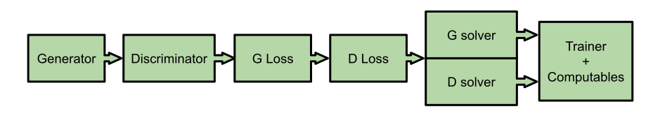

# Source code of Constrained Adversarial Networks

## Reproduce the results
Each bash script will run experiments for `5` times with different seeds. To see the `tensorboard` logs, launch

```bash
tensorboard --logdir out/tensorboard
```
the `out` folder will contain all the results:
- `out/log`: copy of terminal output used for debugging
- `out/model_checkpoints`: reusable checkpoints of the training phase
- `out/images`: sample images generated while training
- `out/tensorboard`: tensorboard plots of losses, metrics and other parameters


### Constraint on super mario bros pipes

Baseline (GAN)
```bash
bash launch/level_generation/mario-pipes-baseline.sh
```

CAN
```bash
bash launch/level_generation/mario-pipes-can.sh
```


### Constraints on super mario bros reachability

Baseline for level 1-3
```bash
bash launch/level_generation/mario-reachability-1-3-baseline.sh
```

Baseline for level 3-3
```bash
bash launch/level_generation/mario-reachability-3-3-baseline.sh
```


CAN for level 1-3
```bash
bash launch/level_generation/mario-reachability-1-3.sh
```

CAN for level 3-3
```bash
bash launch/level_generation/mario-reachability-3-3.sh
```


### PIER PUT YOUR SCRIPTS HERE

```bash
prova prova sah! sah!

```

# Table of contents
1. [Modules](#modules)  
1.1 [Generators](#generators)  
1.2 [Discriminators](#discriminators)  
1.3 [Generator losses](#generator_losses)  
1.4 [Discriminator losses](#discriminator_losses)  
1.5 [Optimizers](#optimizers)  
1.6 [Statistics](#statistics)  
1.7 [Building the graph: recap](#modules_recap)  
1.8 [Computables](#computables)  
1.8.1 [Constraints Computables](#constraints_computables)  
2. [The Experiment class](#experiment)  
2.1 [Visibility of custom classes](#visibility)
3. [The experiment.json file](#experiment_json)


This picture may seem confusing at first, but it roughly encapsulates what's
happening during a run.  
After reading the following documentation you should check back on this picture
and see if it makes more sense.


<a name="modules"></a>  
# Modules
The code is organized in different modules that can be plugged in or out
given your needs or the experiment at hand, here we define what those "pluggable" units are, 
their role and their API.  
Most pluggables roughly follow a simple pattern: they accept a dictionary, called `graph_nodes` that
contains all important nodes of the computational graph, and return another dictionary
of nodes, that will be merged with `graph_nodes`, asserting that no nodes with the same name
are present.
The `graph_nodes` dictionary maps node names (strings) to tf nodes, and it is a way
of communication between all the different pluggable modules, indeed, the computation
graph is built by passing the `graph_nodes` dictionary to all pluggable modules, in some
order, which is actually the same order in which we present these different
classes in this section (apart from statistics).
Remember: the nodes returned by a certain class will be visible only to
classes called after that.  
This picture may seem confusing at first, but it roughly encapsulates what's
happening when the computation graph is built.  
After reading the following documentation you should check back on this picture
and see if it makes more sense.  




There are some expectations to allow interoperability between different, custom modules,
as an example, the dictionary of nodes returned by every generator should contain a node
named `G_sample`, which is the actual output of the generator, this way every discriminator, 
or other modules, have the certainty that in `graph_nodes` they will be able to find `G_sample`,
and keep building the computational node using that.  
For each pluggable module we now define its API, what it must do and what it can do.

Each generator, discriminator, loss, solver or statistic should subclass the general class in 
`base_layers.py`. This provides a simple interface to avoid overriding the `__call__` method.
Your module should instead override `_pre_processing(**graph_nodes)`, `_forward(**graph_nodes)` and
`_post_processing(**res)`. The first method should assert that all nodes required by your
architecure are present in `graph_nodes`, e.g. `assert "G_sample" in graph_nodes`. The second method 
should build the computational graph, starting from some nodes in `graph_nodes`. Finally, if you
think you should do some final operation on the tensorflow nodes you just created, you shoud override the third method.
The third method does not receive `graph_nodes` but the results of `_forward` instead.
The third method should return nothing.


<a name="generators"></a>  
## Generators
Generators are the starting point of the computational graph.  
The constructor accepts an experiment instance (explained later) as an
argument.  
Calling on the instance (`__call__`) method and passing
the `graph_nodes` we obtain the output.  
You can implement one entirely by yourself, or subclass one of the already
provided base classes in `base_layers.py`.  
In any case you may
want to init your variables/layers in the constructor and to actually
keep on building the computational graph starting from `graph_nodes`
in the `__call__` or `_forward` method. Generators usually do not need
to check if some node is present in `graph_nodes` because they are the
starting point of the computational graph.

| Input | graph_nodes |
| ------ | ----------- |

| Output | G_graph_nodes, nodes_to_log |
| ------ | ----------- |

| Must | "G_sample" node must be contained in the new nodes G_graph_nodes |
| ------ | ----------- |

| Must | "z" node must be contained in the new nodes G_graph_nodes |
| ------ | ----------- |
| Note| This node is a placeholder for noise needed by the generator, which will be fed at every iteration by the trainer|
   ```python
        generator = MyGenerator(experiment)
        G_graph_nodes, G_to_log = generator(**graph_nodes)
        graph_nodes = safe_merge(graph_nodes, G_graph_nodes)
   ```
As discussed, the newly provided nodes (`G_graph_nodes`) will
be merged with `graph_nodes`, so that these new nodes
may be visible by modules called later.  
`G_to_log` is, again, a dictionary mapping node names to tf nodes.
Everything you provide here will be run at every training, validation, or
testing iteration and printed in the log. Returning an empty dictionary
is fine if you are not interested in logging anything.
Check some generators in `polygons_floor/generators.py` or the base class
`base_layers.py` to get started.

 
<a name="discriminators"></a>  
## Discriminators
With a discriminator we keep on building the computational graph.  
The constructor accepts an experiment instance (explained later) as an
argument.  
Calling on the instance (`__call__`) method and passing
the graph_nodes we obtain the output.  
You can implement one entirely by yourself, or make use of the already
provided base classes in `base_layers.py`.  
In any case you may
want to init your variables/layers in the constructor and to actually
keep on building the computational graph starting from graph_nodes
in the `__call__` or `_forward` method. Discriminators usually use
the `_pre_processing` method to `assert "G_sample" in graph_nodes`.

| Input | graph_nodes |
| ------ | ----------- |

| Output | D_graph_nodes, nodes_to_log |
| ------ | ----------- |

| Must | Provide the "X" node within the new nodes D_graph_nodes |
| ------ | ----------- |
|Note | This node is a placeholder for real data, that will be feed by the trainer at each iteration |

   ```python
        discriminator = MyDiscriminator(experiment)
        D_graph_nodes, D_to_log = discriminator(**graph_nodes)
        graph_nodes = safe_merge(graph_nodes, D_graph_nodes)
   ```
 The newly provided nodes (`D_graph_nodes`) will
 be merged with graph_nodes, so that these new nodes
 may be visible by modules called later.  
 `D_to_log` is, again, a dictionary mapping node names to tf nodes, 
 which value will be logged at each training, validation or testing
 iteration.
 

<a name="generator_losses"></a>  
## Generator Losses
The computational graph continues with the generator loss. By now you should be 
accostumed by how things work.  
We pass the `graph_nodes`, the class instance
will "look" inside it for the nodes it needs/excepts, and return some
new nodes and nodes which value must be printed at every iteration.  
You can implement one entirely by yourself, or make use of the already
provided base classes in `base_layers.py`.  

| Input | graph_nodes |
| ------ | ----------- |

| Output | G_loss_nodes, nodes_to_log |
| ------ | ----------- |

| Must | Provide the "G_loss" node with the new nodes G_loss_nodes|
| ------ | ----------- |

   ```python
        generator_loss = Generator_loss(experiment)
        G_loss_nodes, G_loss_to_log = generator_loss(**graph_nodes)
        graph_nodes = safe_merge(graph_nodes, G_loss_nodes)
   ```
   
<a name="discriminator_losses"></a>  
## Discriminator Losses
We go on with the discriminator loss, we pass the `graph_nodes`, the class instance
will "look" inside it for the nodes it needs/excepts, and return some
new nodes and nodes which value must be printed at every iteration.  
You can implement one entirely by yourself, or make use of the already
provided base classes in `base_layers.py`.  

| Input | graph_nodes |
| ------ | ----------- |

| Output | D_loss_nodes, nodes_to_log |
| ------ | ----------- |

| Must | Provide the "D_loss" node with the new nodes D_loss_nodes |
| ------ | ----------- |

   ```python
        discriminator_loss = discriminator_loss(experiment)
        D_loss_nodes, D_loss_to_log = discriminator_loss(**graph_nodes)
        graph_nodes = safe_merge(graph_nodes, D_loss_nodes)
   ```
 
<a name="optimizers"></a>  
## Optimizers
To complete the computational graph we need 2 tf optimizer nodes, 1 for
the generator and 1 for the discriminator.
By the time we have defined our losses we have everything we need
in graph_nodes.  
As usual, you can implement optimizers yourself, or make use of the already
provided base classes in `base_layers.py`.  

| Input1 | parameters to optimize|
| ------ | ----------- |
| **Input2** | **graph_nodes** |

| Output | solver/optimizer node|
| ------ | ----------- |

   ```python
        theta_G = utils_tf.train_vars("can/generator")
        theta_D = utils_tf.train_vars("can/discriminator")
        discriminator_optimizer = experiment["DISCRIMINATOR_SOLVER"](experiment)
        generator_optimizer = experiment["GENERATOR_SOLVER"](experiment)
        D_solver = discriminator_optimizer(theta_D, **graph_nodes)
        G_solver = generator_optimizer(theta_G, **graph_nodes)
   ```
Optimizers return a single node, this is the tf operation that will be called
at each training step, in order to adjust parameters.  
Caveat: as you can see the trainer will look for variables with prefix `can/generator`
and `can/discriminator`. When implementing your layers be sure to either be in the
scope `generator` or `discriminator`, everything will already be in the `can` scope.  
Check already present implementations for more clarity.


<a name="modules_recap"></a> 
## Building the graph: recap
This concludes the description of the different pluggable classes
that can be used to build the computational graph.
There is at least one ready implementation (usually more)
for each of these modules in the repository. Before writing one from scratch,
it would be better to check those out (and the base classes in `base_layers.py`).  
We tried to minimize the nodes that are required to be present
in `graph_nodes`, in order to allow for more inter-operability, the trade off
is that checking for the existence of these nodes is the duty of the user,
or better, the duty of the class that is going to use them.  
For example, the discriminator class is not required to return
`D_fake` and `D_real` nodes, (the score the discriminator gives to fake and real data), 
so the discriminator loss class is in charge of checking that these nodes
are actually in `graph_nodes` if they are required/used in the construction
of the `D_loss` node.  
In synthetis: you are allowed to use and mix different modules/pieces/classes,
just make sure these pieces fit togheter.  
If you make use of the base classes in the `base_layers.py` module, the intended
place for assertions is the `_pre_processing` method, while tensor computations
should be inserted in the `_forward` method.
Moreover, remember to avoid name clashing when defining
nodes to be merged in `graph_nodes` and in the nodes to be logged or in tensorboard
summaries (clashing is actually asserted for `graph_nodes` and the nodes to be logged).


<a name="computables"></a>  
## Computables 
By default, the trainer will provide/feed to the tf graph, at each iteration,
the noise vector `z` and batch of real data `X`.  
This is done by constructing the feed dict for the session by assigning
to `z` and `X` (from the `graph_nodes`, `z` and `X` are simply keys/names by which
we find those placeholders) some values.

   ```python
        feed_dict = {
            # generate batch_size random input noises
            graph_nodes["z"]: some_noise(),
            graph_nodes["X"]: some_data()
        }
        # operations are, for example, the output of the solvers
        session.run(operations, feed_dict)
   ```
However, you might be interested in feeding to the graph something else
or something more.   
It could be another noise vector, `z_2`, assuming
that such node/placeholder is in `graph_nodes`, or it could
be something else completely.  

Computables are custom classes by which you can do that. Every computable
must inherit from Computable (`computables.py` module).   
In the constructor you have your chance at setting fields, saving some
experiment parameters, data, and `graph_nodes`.

| Input1 | experiment |
| ------ | ----------- |
| **Input2** | **graph_nodes** |
| **Input3** | **train data** |
| **Input4** | **validation data** |
| **Input5** | **testing data data** |
| **Input6** | **graph_nodes** |

   ```python
        computable = MyComputable(exp, train_data, valid_data, test_data, graph_nodes) 
   ```
   
At every training, validation, testing iteration the trainer
will fill the tf feed dictionary with the usual `z` and `X`, and
after that it will call all the computables you have provided, in order,
to fill/modify the dictionary further, with the `compute` method.

| Input1 | experiment | experiment class instance |
| ------ | ----------- | -----|
| **Input2** | **feed_dict** | **current state of the feed dict** |
| **Input3** | **shared_dict** | **current state of the shared dict** |
| **Input4** | **current epoch** | **current epoch number** |
| **Input5** | **real data indices** | **data indices related to the data in "X"**|
| **Input6** | **generator step** | **True/False, if this is a generator or discriminator step**|
| **Input7** | **step type** | **Either "training", "validation" or "testing"**|

For each computable you have defined, the trainer will call the compute
method by passing these arguments, thus giving you all possible information
that you might be interested in, in order to decide the values
you want to return.

   ```python
        feed_dict = {
            # generate batch_size random input noises
            graph_nodes["z"]: some_noise(),
            graph_nodes["X"]: some_data()
        }
        
        # this actually happens for every computable you have provided
        computable.compute(feed_dict, shared_dict, epoch, real_data_indices=real_tensors_indices, 
                            generator_step=False, step_type=step_type)
        # feed_dict is now modified/filled with more stuff
        session.run(operations, feed_dict)
   ```
<a name="constraints_computables"></a>  
## ConstraintsComputables
One possible use case for Computables is to fill in constraints
values (0 for respected, 1 for not respected) as extra features
of already generated samples, similarly on hows it has been
done in the past 2 CAN thesis, where given a starting noise `z`, one
would compute the result fake/generated samples, compute constraints values
on them, then run the actual whole graph by also feeling those values in the tf
feed dict.  
ConstraintComputable from the computables module is an extension
of the Computable class, which does this. It takes care of:
- computing and caching constraint values on real data
- running `G_sample` internally, on the current state of the feed dict, to compute both real and fake data 
constraints values
- In a validation/testing step, constraint values are always computed and logged
- Logging is done on csv files in the log directory of the experiment, each
ConstraintsComputables will produce up to 4 files (real/fake data + testing/validation step). These
files are made to be easy to use/parse on the get go, and are named
after the specific class of the ConstraintsComputables + step type + data type.
- if `CONSTRAINTS_FROM_EPOCH` has a valid value and the current epoch
is past or equal that, then the training mode is considered constrained, 
and constraints values will be computed for real and fake data; otherwise
proxy values (all equal to zeros) will be returned.
- It will check for the existence of `C_real`, `C_fake` and `use_constraints` nodes in the
`graph_nodes` dictionary, and fill the `feed_dict` by mapping the `C_real` node to real
constraints values, `C_fake` to fake constraints values, and the `use_constraints` node (if present)
to a boolean equal to `curr_epoch >= experiment["CONSTRAINTS_FROM_EPOCH"]`.  

If you wish to have all this functionality on the get go, you simply
have to extend this class and implement two functions: `constraint_names`
(what are the name of each constraint computed on each sample?) and
`_constraints_function` (the actual constraints computation, which you might want to 
implement in numba).  
An example:
   ```python
        class AreaMulti(ConstraintsComputable):
            def __init__(self, experiment, training_data, validation_data, test_data, graph_nodes):
                super().__init__(experiment, training_data, validation_data, test_data, graph_nodes)

            @staticmethod
            def constraints_names():
                """
                Returns a list of names, where ith name represent the ith constraint computed
                by the constraint function of this class. Make sure the length of this list
                is equal to the number of constraints computed for each data point.
                :return:
                """
                names = [
                    "_greater_area_inner",
                    "_smaller_area_inner"]
                return names

            def _constraints_function(self, data):
                """
                This is the function that effectively computes constraints on given data, must be implemented by the user.
                :param data: Data on which to compute the constraints function.
                :return:
                """
                return my_function(data)
   ```
Please refer to the base class in the computables module and/or the
extended classes in `polygons_floor/computables.py` to check out
the implementation/more documentation.

  
<a name="statistics"></a>  
## Tensorboard statistics
You might be interested in sending statistics about nodes to tensorboard
instead of logging them.  
You can specify statistic for the generator and for the discriminator. 
These classes will be instantiated
after the generator, discriminator, generator loss and discriminator loss
respectively.
They all follow the same pattern, the constructor accepts the
experiment class, while the `_forward` method accepts the `graph_nodes`
as an argument. You can use, as usual, the `_pre_processing` method to assert
that all nodes you need are in `graph_nodes`.
All statistic classes return a tf summary, and summaries are then merged all togethers
before being sent to tensorboard. Summaries can be on all the nodes of the computational
graph that has been added to `graph_nodes`. The statistics on the generator and 
the discriminatorwill be computed during the generator and discriminator step respectively.

| Input | graph_nodes |
| ------ | ----------- |

| Output | Tf summary.
| ------ | ----------- |

   ```python
        generator_statistic = Generator_statistic(experiment)
        G_summaries_nodes = generator_statistic(**graph_nodes)
        ...
        discriminator_statistic = discriminator_statistic(experiment)
        D_summaries_nodes = discriminator_statistic(**graph_nodes)
   ```
   

<a name="experiment"></a>  
# Putting the pieces together: the Experiment class
This class covers everything that characterizes an experiment/run, **once an instance
has been created, it should considered read only.**

Adding new functionalities or fields after the creation of an instance is to be avoided.

**The class works in this way:**
1) it imports public classes from the provided modules
2) given the experiment file, it reads parameters that are common to every experiment
3) based on the **mandatory** `DATASET_TYPE` parameter, it calls a dataset specific loader which, given the input experiment file (parsed as a dict), will take care of reading the necessary and dataset specific parameters.
4) it adds some internal parameters needed for logs, checkpoints, storage, etc.
    
**As a newcomer in this repository, you can (should) use the following pattern
to add your work:**
- create a directory in `src/` with a name of your choice
- write your generators, discriminators, losses, solvers, computables, whatever in your own modules and put them in your directory. generators, discriminators, losses, constraints and solvers should subclass the default classes in `generators.py`, `discriminators.py`, `losses.py`, `computables.py` and `solvers.py`
- add the modules you want to be imported in the Experiment modules lists
- hardcode in the if/else statement of `load_specific_config` a new case, which take care of your dataset type.  
Here you should provide a specific parameters dictionary, a `get_dataset` function and a `plot_data` function.
- run your `experiment.json`, you will be able to use your stuff but also stuff coming from everyone else (others 
    people architectures, etc.)
    
**Usage pattern in more detail:**
- create a new directory, which will contain your code, here you can specify new architectures, constraints,
    solvers and losses. 
    It is reasonable to follow the root directory pattern, i.e. name your modules like 
    `generators.py`, `discriminators.py`, `constraints.py`, `losses.py`, `solvers.py`.
- given your modules, you make your classes visible to our loader by 

    1) having them NOT starting with `_`, this means that, for example, classes named `_CoolArchitecture` 
        in your `generators.py` module will be ignored, while `CoolerArchitecture` will be picked up.
        
    2) Adding the stuff you want to be loaded in the related modules list of the Experiment class.  
       This is pretty simple, let's say your personal directory is called `semantic_loss`, where you have
       your own personal discriminators, (`discriminators.py`), which contains your brand new discriminator.  
       First, import the module from which you want its public functions to be collected:
       
       ```python
        from semantic_loss import architectures as sem_architectures
       ```

       Then, add this module to the list of discriminators:
    
       ```python
        class Experiment:
            generators_modules = [common_generators]
            discriminator_modules = [common_discriminator, sem_discriminators]
            constraints_modules = [common_constraints]
            solvers_modules = [common_solvers]
            losses_modules = [common_losses]
       ```
    
        This will make sure that public functions and classes inside `semantic_loss/discriminators.py` are picked up, and will
        be visible and be usable for all experiments. I.e. in your `experiment.json` you will be able to use
        whatever was in architectures, i.e `"DISCRIMINATOR": "CoolerArchitecture"`.
    
- Add your specific parameters loader, data loader and data plotter to the `Experiment.__load_specific_config()`.  
    This is overall pretty simple, and you have total freedom apart from the signature of `data_loader` and
    `data_plotter` functions.  
    As an example, let's look at what we did for the `SAT` dataset: 
    
   ```python
    if common_config["DATASET_TYPE"] == "SAT":
        from semantic_loss.loader import get_config as sat_get_config
        specific_config = sat_get_config(config_as_dict)

        from semantic_loss.loader import get_dataset as sat_get_dataset
        get_dataset = sat_get_dataset

        from semantic_loss.loader import plot_data as sat_plot_data
        plot_data = sat_plot_data
   ```
    
    Let's break this down:
    ----------------------------------------------------------------
    **First**, we check if we are dealing with this kind of dataset.
    
   ```python
        if common_config["DATASET_TYPE"] == "SAT":
   ```
    ----------------------------------------------------------------
    **Second**, we import a function that, given the `experiment.json` file parsed as a dictionary,
    will take care of reading the needed parameters, checking their correctness, assertions, etc.   
    You have total freedom on what you do inside this function, as long as you return a dictionary that we can later
    merge with the common parameters. Try not to re-define common parameters.  
    Given the signature of `Experiment.__load_specific_config`, you can actually access many different things
    for the purpose of building your specific parameters dictionary.
   ```python
        from semantic_loss.loader import get_config as sat_get_config
        specific_config = sat_get_config(config_as_dict)
   ```
    
    ----------------------------------------------------------------
    **Third**, we provide a function that will return the training, test, validation set upon being called
    with no arguments.
   ```python
        from semantic_loss.loader import get_dataset as sat_get_dataset
        get_dataset = sat_get_dataset
   ```
    Again, you have total freedom on what happens internally, if you load from pickles, images, whatever.
    
    ----------------------------------------------------------------
    **Fourth**, we provide a data plotter, which will be used during the run to create evaluation images. 
   ```python
        from semantic_loss.loader import plot_data as sat_plot_data
        plot_data = sat_plot_data
   ```
    Plot data will be called as plot_data(samples, epochs number). It is expected to return anything and to save stuffs in `out/images/name` of the experiment.  
    If you don't want your data plotted or do not have a plot function, 
    simply set it to None and the trainer will skip the evaluation
    images plotting step.
    ```python
        plot_data = None
    ```
-   We are done and can now run our experiment with whatever parameters we wanted to add, by specifying
    them in the `experiment.json` along with the common parameters.   
    A `template.json` experiment file containing the common parameters is provided in `in/experiments`.


<a name="visibility"></a>  
## Visibility of custom classes
As explained, you can add new architectures, losses,
solvers, computables and statistics by adding to the Experiment
class their relative modules.
Initially, at least, you should not start from
scratch but rather copy something from the
common modules or from some specific modules, this will
help you better understand the inner workings of the more
complex things, like the discriminators or generators,
which have been already explained here.  
Generators, discriminators, losses, solvers, constraints, computables
and statistics that you
want to make visibile must be in their respective modules
with a name that is not beginning with `_`.   Stuff beginning
with `_` is to be considered private and will be ignored.


<a name="experiment_json"></a>  
#### Example of an experiment.json file
The name that you give to the experiment.json file you pass to the main will
simply be the name of the directories where logging, tensorboard output, etc. will go.  
We now proceed to explain the parameters that are common to all experiments files,
regardless of specific parameters that will later be picked up by the specific config
loader.  
You can find an example of experiment file in `in/experiment/template.json`, you might
have to remove comments from it in order to be able to run it, afterwards you can edit
or add any specific parameter you intend to use in your specific configuration.  
Note: this is a work in progress, based on our findings in reading the original
source code and on our refactoring.

| PARAMETER NAME                  | TYPE  | DESCRIPTION                                                                                                                                                                                                                                                                                                                                                                                                                       | EXAMPLE                  |
|---------------------------------|-------|-----------------------------------------------------------------------------------------------------------------------------------------------------------------------------------------------------------------------------------------------------------------------------------------------------------------------------------------------------------------------------------------------------------------------------------|--------------------------|
| DATASET_TYPE                    | `str`   | Type of the dataset to use. Based on this, a different specific configuration loader will be called in the instantation of an experiment file.                                                                                                                                                                                                                                                                                    | `polygons`               |
| SHAPE                           | `list`  | List of ints which describes the shape of training data. | `[20, 20, 1]`              |
| ANN_SEED                        | `int`   | Seed used to generated batch indexes and to train and test the network.                                                                                                                                                                                                                                                                                                                                                           | `1337`                     |
| GENERATOR                       | `str`   | Name of the generator class to use.                                                                                                                                                                                                                                                                                                                                                                                                     | `Gan20Generator`              |
| DISCRIMINATOR                   | `str`  | Name of the discriminator class to use.                                                                                                                                                                                                                                                                                                                                                                                                 | `Can20Discriminator32LayerAuto` |
| GENERATOR_LOSS                  | `str` or `list`  | It can be the name of the generator loss class, a list of losses or a list of pairs (loss name, weight). Pairs should be lists.                                                                                                                                                                                                                                                                                                                                                                            | `BganGeneratorLoss`            |
| DISCRIMINATOR_LOSS              | `str` or `list`  | It can be the name of the discriminator loss class, a list of losses or a list of pairs (loss name, weight). Pairs should be lists.                                                                                                                                                                                                                                                                                                                                                                          | `BganDiscriminatorLoss`          |
| GENERATOR_SOLVER              | `str`   | Name of the solver class for the generator.                                                                                                                                                                                                                                                                                                                                                                                  | `GeneratorAdamSolver`          |
| DISCRIMINATOR_SOLVER              | `str`   | Name of the solver class for the discriminator.                                                                                                                                                                                                                                                                                                                                                                                  | `DiscriminatorAdamSolver`          |
| COMPUTABLES                      | `str`   | A list with 0 or more computables.                                                                                                                                                                                                                                                                                                                                                                                  | `["FloorPlanningConstraints"]`          |
| GENERATOR_STATISTICS                      | `list`   | A list of 0 or more statistics that will be computed during the generator step. They should interest the generator nodes.                                                                                                                                                                                                                                                                                                                                                                           | `["MultinomialGeneratorStatistics"]`          |
| DISCRIMINATOR_STATISTICS                      | `list`   | A list of 0 or more statistics that will be computed during the discriminator step. They should interest the discriminator nodes.                                                                                                                                                                                                                                                                                                                                                               | `["GanDiscriminatorStatistics"]`          | 
| BATCH_SIZE                      | `int`   | Size of the batch to use during training.                                                                                                                                                                                                                                                                                                                                                                                         | `64`                       |
| NUM_BGAN_SAMPLES                | `int`   | Number of samples to generate for each distribution generated by the generator in the BGAN architecture.                                                                                                                                                                                                                                                                                                                          | `20`                       |
| LEARNING_RATE                   | `float` | Learning rate to use while training.                                                                                                                                                                                                                                                                                                                                                                                              | `1e-4`                     |
| NUM_ITER_GENERATOR              | `int`   | For how many iterations should the generator be trained at every GAN training iteration. <br> **Defaults to 1 if not provided**.                                                                                                                                                                                                                                                                                                                                          | `1`                        |
| NUM_ITER_DISCRIMINATOR          | `int`   | For how many iterations should the discriminator be trained at every GAN training iteration. <br> **Defaults to 1 if not provided**.                                                                                                                                                                                                                                                                                                                                      | `1`                        |
| LEAKINESS                       | `float` | Value of the leakiness of the leaky ReLU activation  function used in the architectures (when used), for  inputs <0.                                                                                                                                                                                                                                                                                                              | `0.2`                      |
| Z_DIM                           | `int`   | Size of the noise input vector for the generator.                                                                                                                                                                                                                                                                                                                                                                                 | `64`                       |
| LEARNING_EPOCHS                 | `int`   | Number of training epochs.                                                                                                                                                                                                                                                                                                                                                                                                        | `250`                      |
| TRAINING_TEST_VALIDATION_SPLITS | `list`  | A list of ints or float that describes how the dataset is split.  The dataset specific configuration loader and dataset function have the freedom (and the duty) to use this to in the way they prefer.                                                                                                                                                                                                                           | `[18940, 4096, 0]`         |
| EVAL_NOISE_SEED                 | `int`   | Seed to use for the generation of evaluation samples, so that the same seed is used for all evaluation phases.                                                                                                                                                                                                                                                                                                                    | `1337`                     |
| CONSTRAINTS_FROM_EPOCH                 | `int`   | Start constraints from a specific epoch, not mandatory.                                                                                                                                                                                                                                                                                                                    | `0`                     |

